<h1 align="center">
  
</h1>

<div align="center">
  
</div>

<br/>

<div align="center">
  
</div>

---


## 👨‍💻 About Me

```python
class DataScientist:
    def __init__(self):
        self.name = "JullMol"
        self.role = "Data Scientist & Developer"
        self.location = "Indonesia 🇮🇩"
        self.languages = ["Python", "JavaScript", "HTML/CSS"]
        
    def current_focus(self):
        return {
            "learning": ["Deep Learning", "Advanced ML"],
            "working_on": ["Data Analysis Projects", "Web Apps"],
            "interests": ["AI/ML", "Data Viz", "Web Dev"]
        }
    
    def say_hi(self):
        print("Thanks for visiting! Let's connect! 🚀")

me = DataScientist()
me.say_hi()
```

<br/>

- 🔭 Currently working on **Machine Learning & Data Science Projects**
- 🌱 Learning **Deep Learning & Neural Networks**
- 👯 Looking to collaborate on **Open Source ML Projects**
- 💬 Ask me about **Python, Data Analysis, Web Development**
- ⚡ Fun fact: **I turn coffee into code! ☕→💻**

<br/>

---

## 🛠️ My Tech Stack

<div align="center">

### 👨‍💻 Programming Languages
<p>
  
  
  
  
</p>

### 📊 Data Science & ML
<p>
  
  
  
  
  
  
</p>

### 🛠️ Tools & Technologies
<p>
  
  
  
  
</p>

</div>

---

## 📊 GitHub Statistics

<div align="center">
  
  
</div>

<div align="center">
  
  
</div>

---

## 🐍 Contribution Snake Game

<div align="center">
  
</div>

---

## 🏆 GitHub Trophies

<div align="center">
  
</div>

---

## 🔥 Featured Projects

<div align="center">

[](https://github.com/JullMol/Pharmora)
[](https://github.com/JullMol/K-Means-Clustering)

</div>

### 💼 Key Projects

- **[Pharmora](https://github.com/JullMol/Pharmora)** ⭐ Python-based Pharmaceutical Management System
- **[K-Means Clustering](https://github.com/JullMol/K-Means-Clustering)** 📊 Multi-Source Food Security Analysis using ML
- **[Learning Algorithm](https://github.com/JullMol/Learning-Algorithm)** 🧠 Classification & Regression Model Evaluation
- **[Gizmo Notes](https://github.com/JullMol/Gizmo-Notes)** 📝 Modern Note-Taking Web Application

---

## 📈 GitHub Activity Graph

<div align="center">
  
</div>

---

## 💡 Random Dev Quote

<div align="center">
  
</div>

---

## 🎯 Current Goals for 2026

```mermaid
graph LR
    A[🎯 Learn] --> B[Deep Learning]
    A --> C[Advanced ML]
    D[🚀 Build] --> E[Portfolio Projects]
    D --> F[Open Source Contributions]
    G[🤝 Collaborate] --> H[Data Science Community]
    G --> I[Research Papers]
```



---

## 📫 Connect with Me

<div align="center">
  <a href="https://github.com/JullMol">
    
  </a>
  <a href="mailto:your.email@example.com">
    
  </a>
  <a href="https://linkedin.com/in/yourprofile">
    
  </a>
  <a href="https://twitter.com/yourhandle">
    
  </a>
</div>

---

<div align="center">
  
</div>

<div align="center">
  
  ### ⭐️ Show some ❤️ by starring some repositories!
  
  
  
</div>
